# Abogabot

AbogaBot es una Aplicacíon Web creada para que encuentres al mejor abogado para tí y automatizar el proceso legal
 
<section>
    <h2>Toma de Requerimientos</h2>
    

    <ul>
        <li>Objetivos
        
Automatizar las demandas de los clientes

        </li>
        <li>Medio
        
Se realizará mediante una WebApp

        </li>
        <li>Usuario
        
Realizará una encuesta que sera enviada por el sistema para su análisis

        </li>
        <li>Sistema
            <ul>
                <li>Procesar y envía información al administrador</li>
                <li>Cobrar por servicio y registrar las ganancias</li>
                <li>Registrar usuarios y guardar su información para que puedan acceder a ella en otros dispositivos</li>
                <li>El administrador se comunicará con el cliente para modificaciones en la demanda</li>
            </ul>
        </li>
        <li>Proceso
            <ol>
                <li>El cliente recibe un formulario 📔</li>
                <li>La web procesa el formulario enviado 🗃</li>
                <li>Antes de seguir, se le manda al proceso de pago 🏦</li>
                <li>Se solicita al cliente crear una cuenta 📮</li>
                <li>El Administrador recibe la solicitud de una nueva demanda, con los datos del formulario se crea el documento legal en digital 📜</li>
                <li>El Administrador recibe el pago y se refleja en un Dashboard para ver todos los ingresos recibidos 📊</li>
                <li>El Administrador actualiza el proceso de la demanda y agrega comentarios en cada paso del proceso. 🖊</li>
                <li>Se envían al usuario correos para notificar el avance de su demanda. 📬</li>
            </ol>
                
La pagina debe ser responsive para poderla ver desde el celular 💻 ⏩📱    AbogaBot, funcionara en las plataformas web y móvil, esta ultima sera necesaria para el seguimiento de actualizaciones del proceso legal.    Los colores del cliente son Azul Marino y Blanco (acepta propuestas) 🐬☁️    La comunicación “Administrador→Usuario” será por notificaciones de las actualizaciones en la WebApp, al igual que si el cliente quiere hablar directamente con el Admin.
                

        </li>
    </ul>
</section>
<section>
    <h2>Buyer Persona</h2>
    

    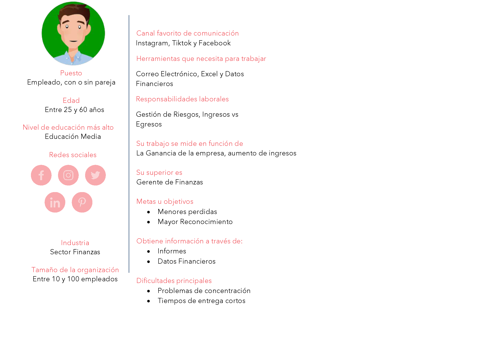
</section>
<section>
    <h2>Publico Objetivo</h2>
    

    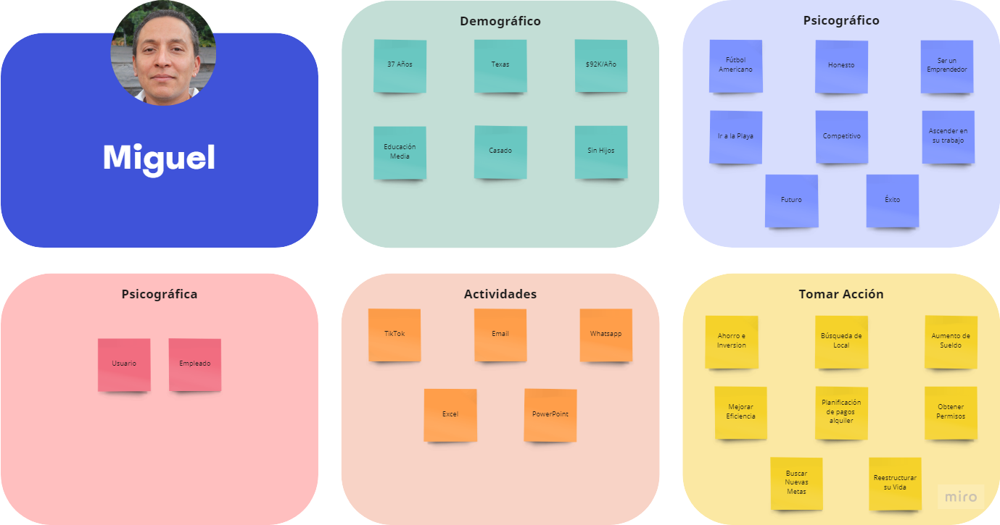
     
    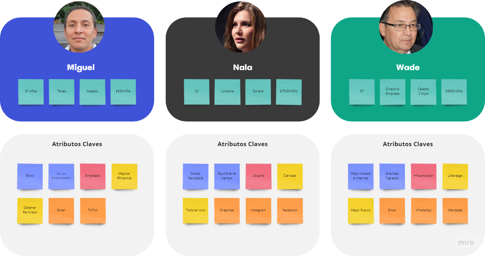
</section>
<section>
    <h2>UX</h2>
    

    <ul>
        <li>Web
            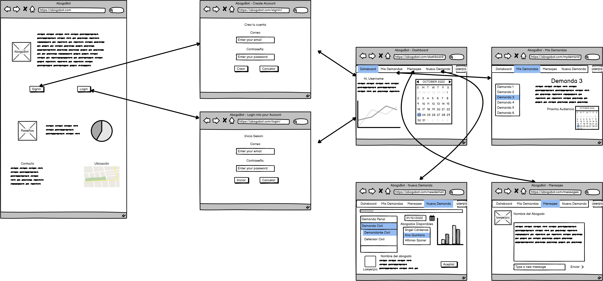
        </li>
        <li>Mobile
            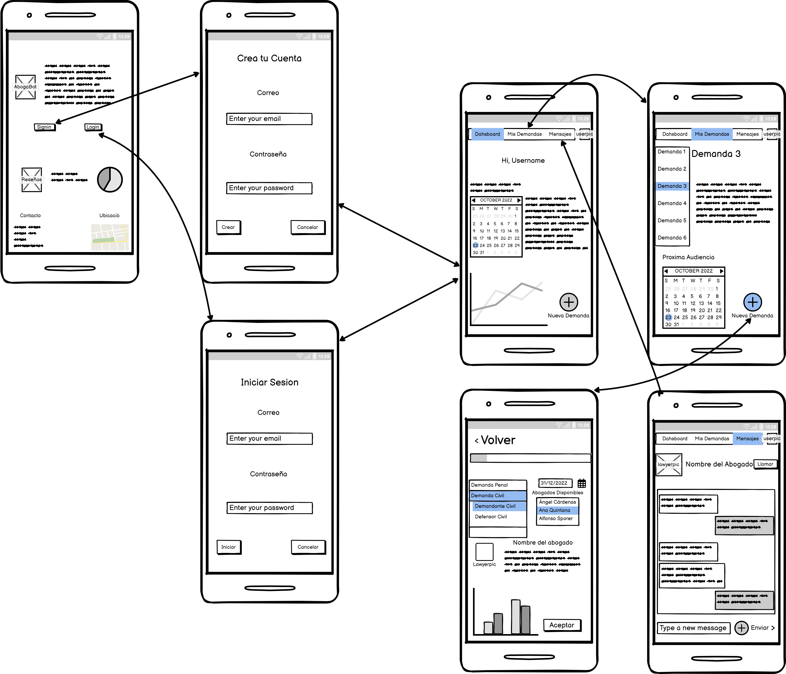
        </li>
    </ul>
</section>
<section>
    <h2>UI</h2>
    

    <ul>
        <li>Web
            <ul>
                <li>Pantalla Principal
                    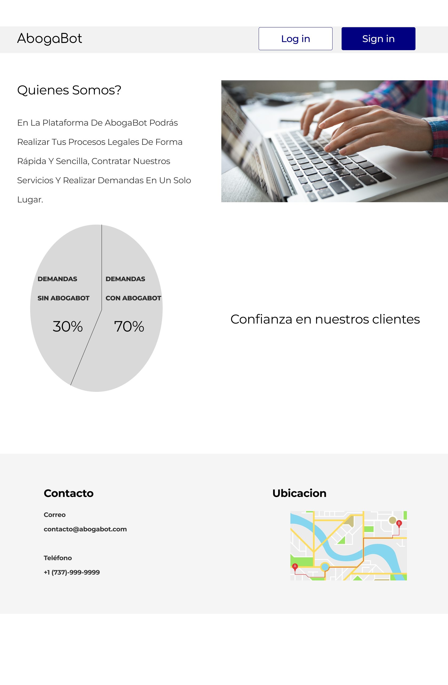
                </li>
                <li>Crear Cuenta/Iniciar Sesion
                    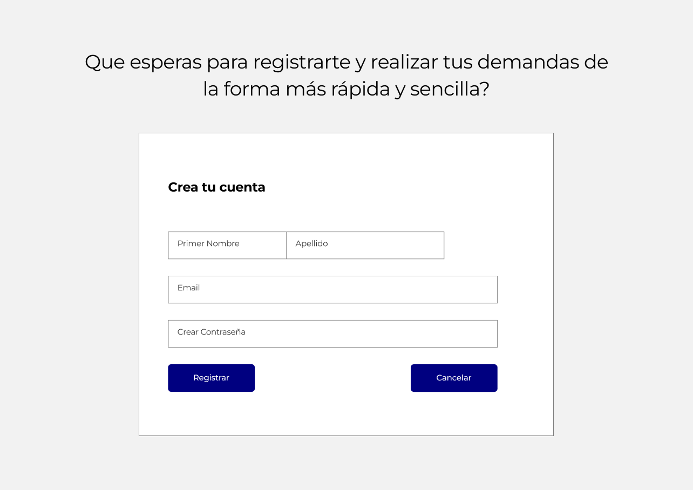
                    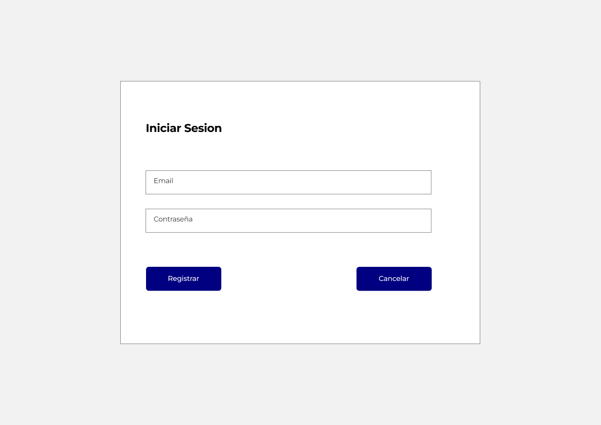
                </li>
                <li>Dashboard
                    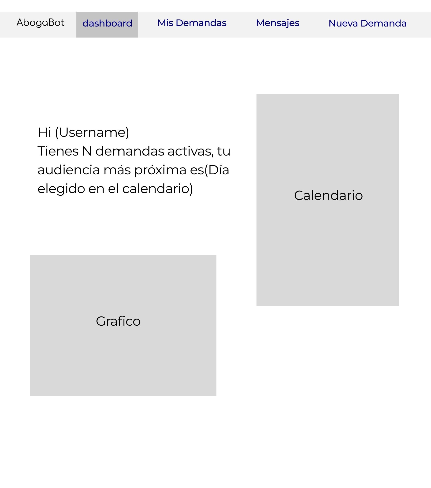
                </li>
                <li>Mis Demandas
                    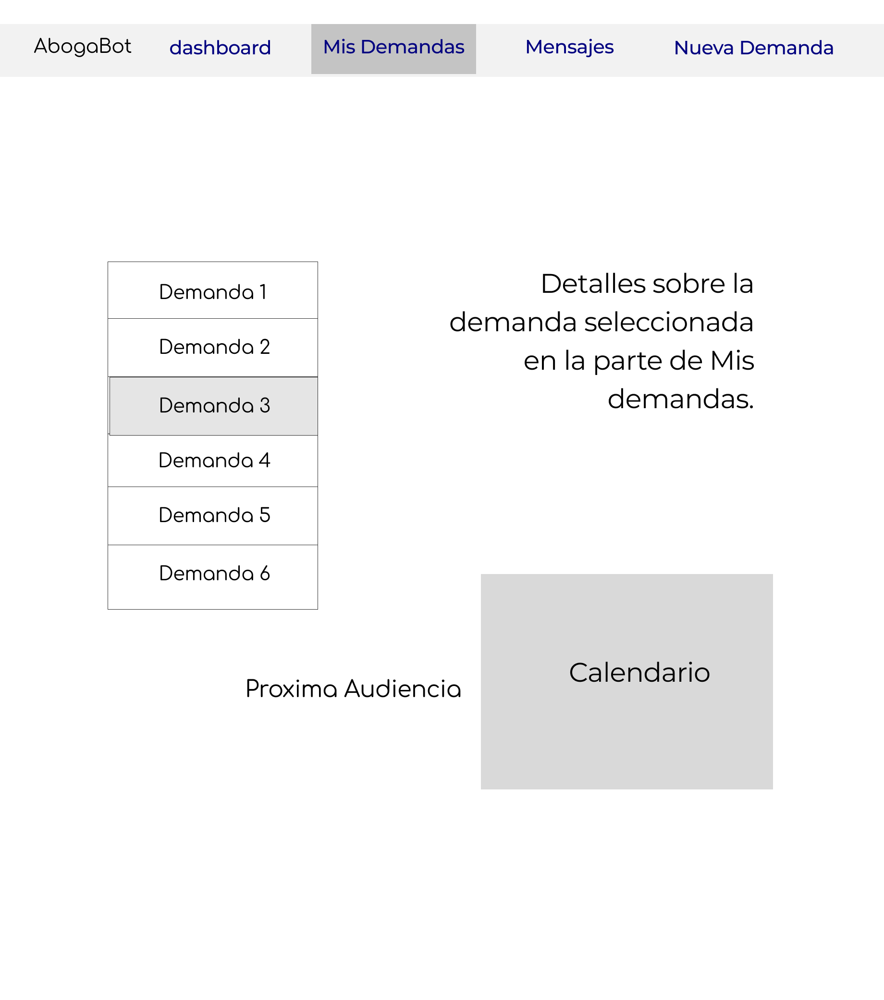
                </li>
                <li>Mensajes
                    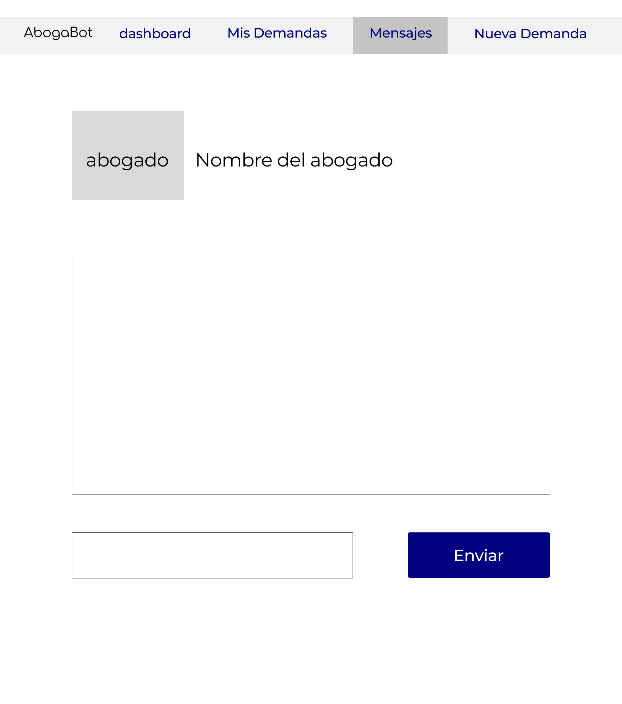
                </li>
                <li>Nueva Demanda
                    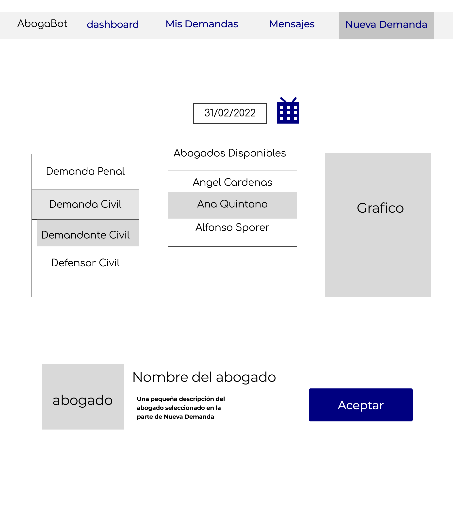
                </li>
            </ul>
        </li>
        <li>Mobile
            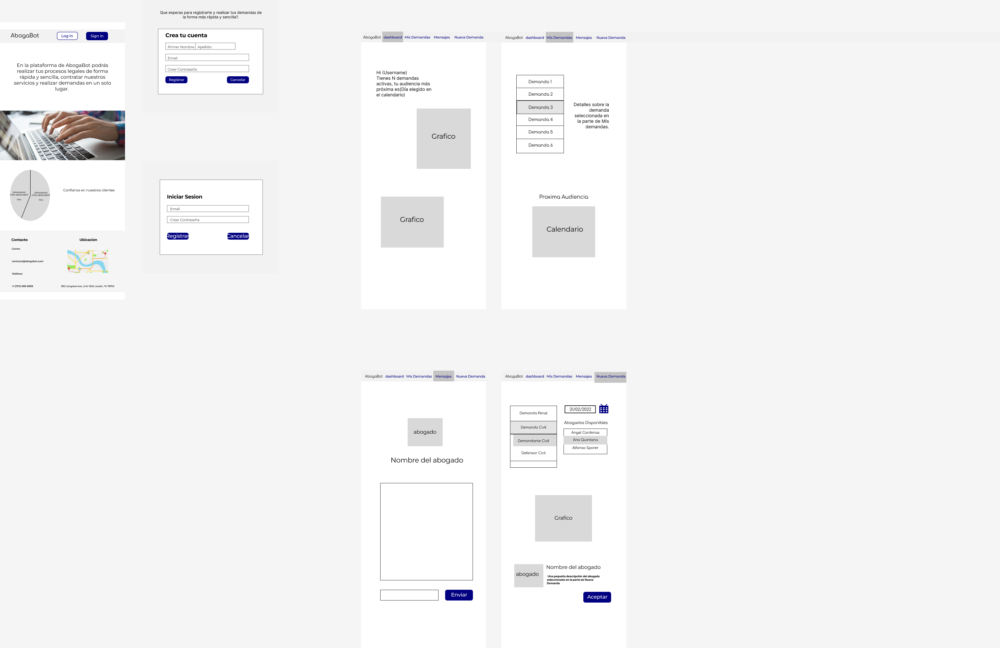
        </li>
    </ul>
</section>